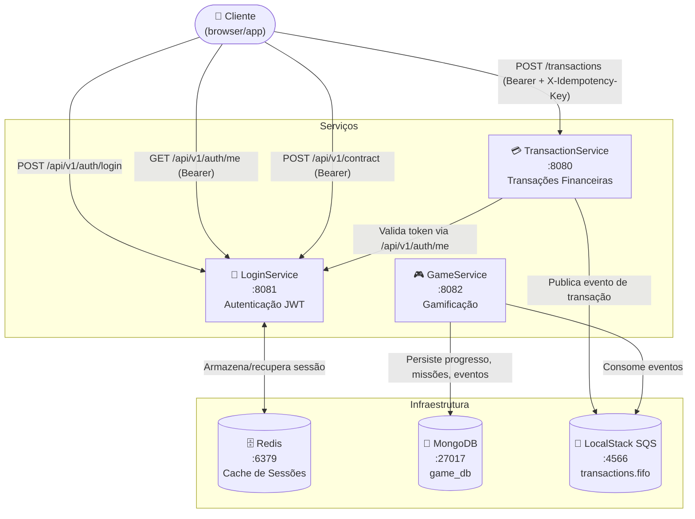

# 🏗️ Arquitetura dos Microsserviços

## Visão Geral

O sistema é composto por três microsserviços independentes que se comunicam de forma síncrona (REST/JWT) e assíncrona (SQS), com persistência em Redis e MongoDB.

---

## 📊 Diagrama de Arquitetura



---

## ⚙️ Tecnologias

| Tecnologia | Versão | Uso |
|------------|--------|-----|
| **Java** | 21 | Linguagem base de todos os serviços |
| **Spring Boot** | 3.3.5 | Framework web e injeção de dependências |
| **Spring Security + JWT** | — | Autenticação e autorização via Bearer token |
| **Redis** | 7 (Alpine) | Cache de sessões de usuário no LoginService |
| **MongoDB** | 6.0 | Persistência de eventos e progresso no GameService |
| **LocalStack / SQS** | 3.0 | Fila FIFO para comunicação assíncrona entre TransactionService e GameService |
| **Resilience4j** | — | Circuit Breaker e Retry no TransactionService |
| **Docker / Docker Compose** | — | Containerização e orquestração local |

---

## 🔄 Comunicação entre Serviços

| De | Para | Protocolo | Descrição |
|----|------|-----------|-----------|
| TransactionService | LoginService | HTTP (WebClient) | Validação do token JWT via `GET /api/v1/auth/me` |
| TransactionService | LocalStack SQS | SDK AWS | Publicação de eventos de transação na fila `transactions.fifo` |
| GameService | LocalStack SQS | SDK AWS | Consumo de eventos da fila `transactions.fifo` |
| GameService | MongoDB | MongoDB Driver | Persistência de game events, progresso e missões |
| LoginService | Redis | Lettuce | Armazenamento e leitura de sessões JWT |

---

## 📁 Estrutura dos Repositórios

```
LoginService/       → github.com/ThiagoCintra/LoginService
TransactionService/ → github.com/ThiagoCintra/TransactionService
GameService/        → github.com/ThiagoCintra/GameService
infra-gameficacao/  → github.com/ThiagoCintra/infra-gameficacao  (este repositório)
```
