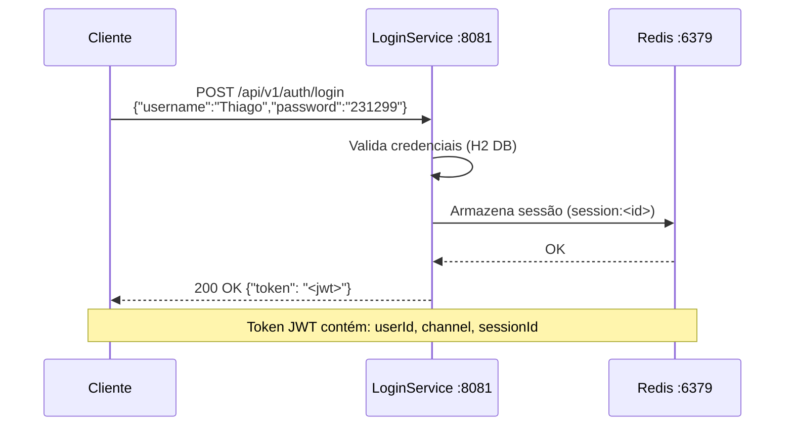
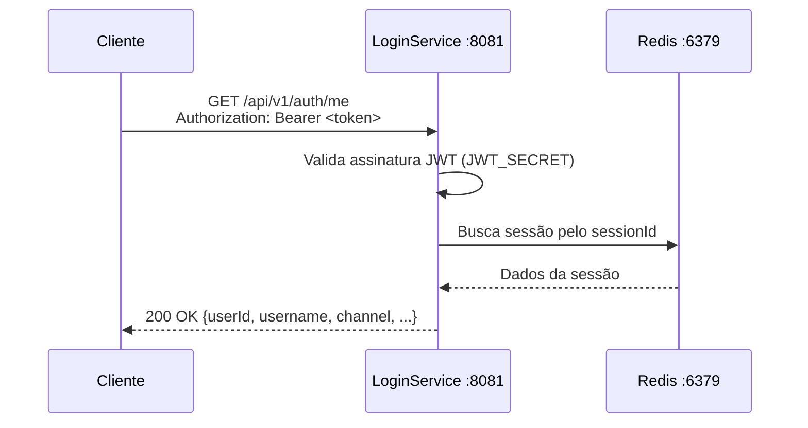
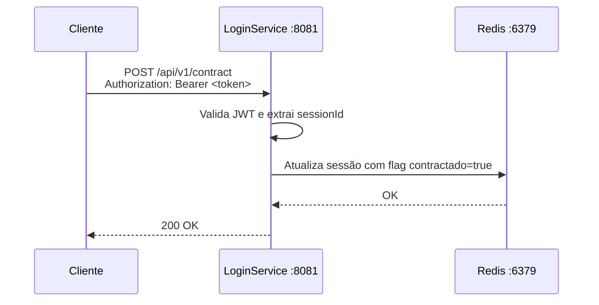
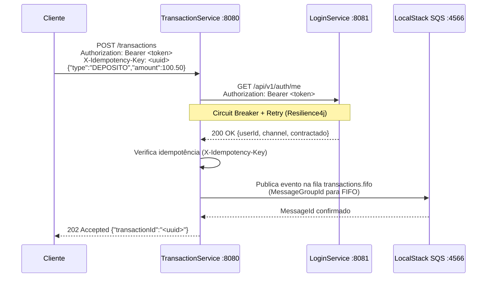
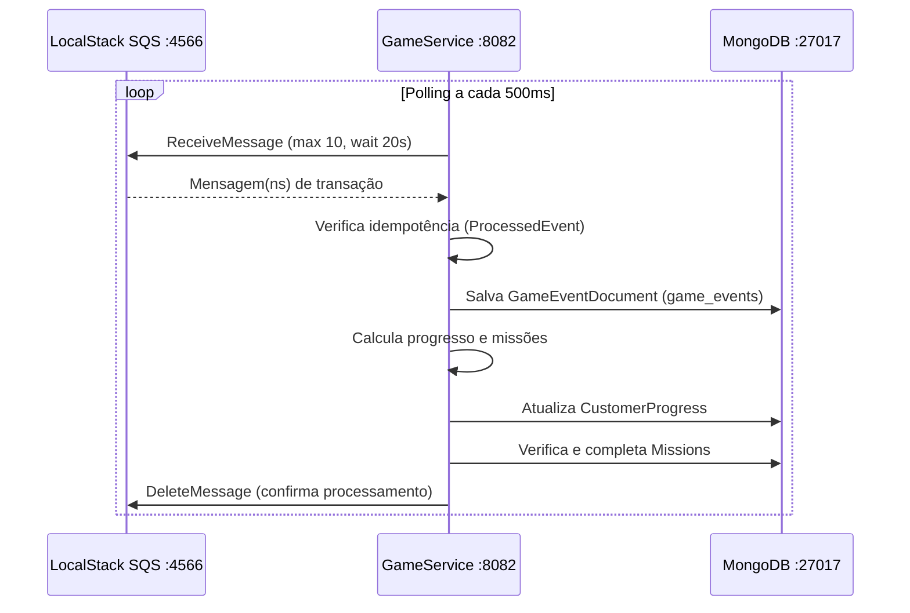
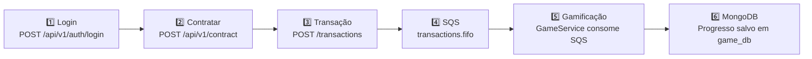

# 🔄 Fluxos

## 1. Fluxo de Login

O usuário envia suas credenciais ao LoginService, que valida, cria uma sessão no Redis e retorna um token JWT.

---

## 2. Fluxo de Consulta do Usuário (`/me`)

---

## 3. Fluxo de Contratação (`/contract`)

O usuário precisa contratar o serviço antes de poder realizar transações.

> ⚠️ Sem contratação, o TransactionService retorna `403 Forbidden` com a mensagem `Contract service required`.

---

## 4. Fluxo de Transação (com Idempotência)

---

## 5. Fluxo de Gamificação (Consumo SQS)

---

## 6. Fluxo Completo (End-to-End)

